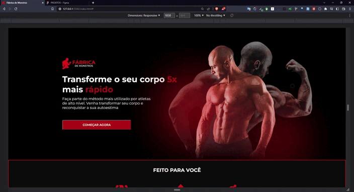

  

<h2>👨‍💻 Sobre o projeto</h2>

  O projeto foi feito com o objetivo de praticar conceitos de Desenvolvimento Web utilizando conhecimentos em Html e Css com pré processador Sass. 
  Tenho planos de implementar Javascript em algumas partes do projeto.
  

<h2>🚀 Tecnologias Utilizadas</h2>

  </img>

<h2>🌐 Hospedagem</h2>

<a href="https://fabricademonstros.netlify.app/">Acesse</a>

