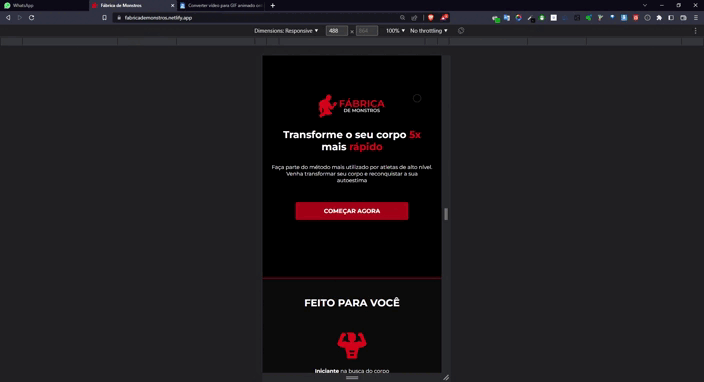

  

  

<h2>👨‍💻 Sobre o projeto</h2>

  ✅ Site totalmente responsivo para todos os tamanhos de tela  

  ✅ Utilizei o pré-processador de css: Sass, para fazer toda a estilização do site, buscando com o mesmo um código fácil de manutenção e com pouca repetições. Implementei sem dificuldade animações às sections do site com o scripit AOS. 
  
  ✅ Ainda pretendo fazer updates no projeto utilizando JavaScript
  

<h2>🚀 Tecnologias Utilizadas</h2>

  </img>

<h2>🌐 Hospedagem</h2>

<a href="https://fabricademonstros.netlify.app/">Acesse</a>

